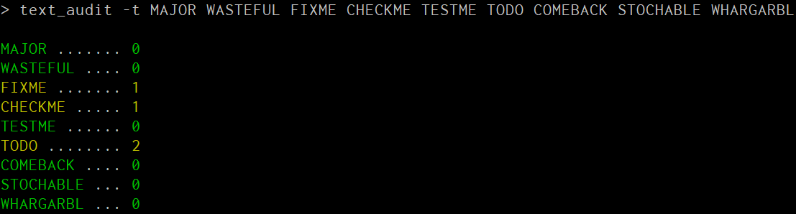

# text_audit
Quickly audit a directory tree for text samples, producing a build-appropriate colored table


<br/><br/>

## ... what?

Look, it's nice to write code with little comments that remind you to go back and do something
later.  So you might write something like

```javascript
function badly_written_function(stuff) {
  // ... do things ...
  // CHECKME FIXME oh god pay someone to get this right when the attacker is gone
  const emergency_wrong_crypto = some_library(stuff, i, dont, understand);  
  // TODO write unit tests
  // TODO go back and make sure this didn't put bad data in the db
}
```

... and then embed it in your `package.json` as a repeatable thing:

```javascript
  "scripts": {
    "audit": "text_audit -t MAJOR WASTEFUL FIXME CHECKME TESTME TODO COMEBACK STOCHABLE WHARGARBL",
  },
```

and then run this command:

```bash
npm run audit
```

and as such receive this bacon:




<br/><br/>

## Wh... why?

Ostensibly this will be the very last step in the build.

It will remind you that there are still six outstanding dumpster fires in the source, so that you
can go `grep` for them.

Let's be honest: this is ***necessary***.


<br/><br/>

# Ok fine but your terms are dumb and I want something else

`-t term term...`

Fine.  `-t` lets you set terms.  They're space separated and case sensitive.


<br/><br/>

## How do I make them case insensitive?

By submitting a PR.


<br/><br/>

# Help, help: it's not finding my stuff

`-g <glob>`

By default, ***this tool assumes that your code is within the glob*** `./src/**/*.js`.

This actually faults me a lot because I use `typescript`.  You can provide your own `glob` on `-g`
according to [these rules](https://github.com/isaacs/node-glob#glob-primer), but by quick example,
I have to write `-t ./src/ts/**/*.ts` for most of my codebases.


<br/><br/>

# What if I want it to be tool-able

`-f <colorRollup|bwRollup|colorList|bwList|json>`

This can emit in (currently) color, black and white, or json; color and black and white can either 
be a single roll-up for all files, or a list per-file, whereas json is both.

For tooling, `json` is recommended.  For display, `colorRollup` is recommended.  For CI/CD, 
`colorList` is recommended, unless it's an older runner that can't handle `vt codes`, at which
point `bwList` is recommended instead.


<br/><br/>

# I don't like seeing zero/empty rows

`-r`

I find it motivating, to see all-green, but okay.  `-r` will only show rows that have faults.


<br/><br/>

# I want this thing silent when it's all-green

`-q`

Fair enough.  This can be important in CI/CD at times.

Quiet mode, or `-q`, will emit nothing and return 0 when there are no problems.
